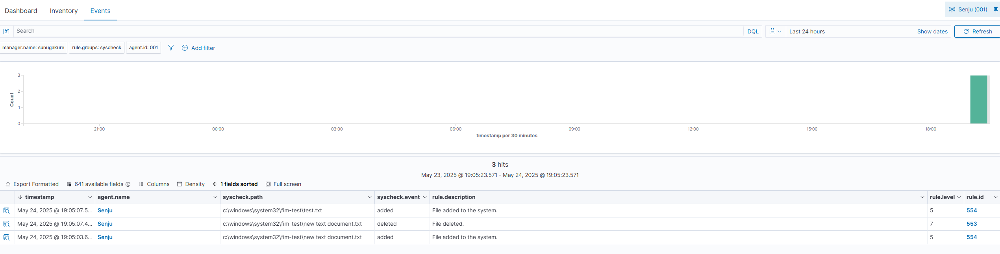

# Windows File Integrity Monitoring (FIM) Lab with Wazuh

This lab demonstrates how to set up and verify File Integrity Monitoring (FIM) on a **Windows 10** machine using the **Wazuh agent**. The lab includes configuration of real-time monitoring, validation in Wazuh dashboard, and the use of **Whodata** auditing for tracking user/process modifications.

---

## 🖥️ 1. Create Test Directory

Open PowerShell as Administrator and run:

```powershell
mkdir C:\Windows\System32\FIM-TEST
```

---

## ⚙️ 2. Configure Wazuh Agent

Edit the Wazuh agent configuration:

```
C:\Program Files (x86)\ossec-agent\ossec.conf
```

Add or modify the `<syscheck>` section as follows:

```xml
<syscheck>
  <disabled>no</disabled>
  <frequency>43200</frequency>
  <scan_on_start>yes</scan_on_start>
  <directories check_all="yes" report_changes="yes" realtime="yes">C:\Windows\System32\FIM-TEST</directories>
</syscheck>
```

Then restart the agent:

```powershell
Restart-Service WazuhSvc
```

---

## 🧪 3. Create a File to Trigger Detection

```powershell
New-Item "C:\Windows\System32\FIM-TEST\test.txt" -ItemType File
```

Go to the **Wazuh Dashboard → File Integrity Monitoring → Events**, filter by agent `Senju`, and validate that the event was captured.

Example event:

```
File: c:\windows\system32\fim-test\test.txt
Event: added
Mode: realtime
SHA1, MD5, SHA256 calculated.
```


---

## 👤 4. Enable Whodata for Auditing

Whodata functionality allows Wazuh to capture **who modified a file** and **which process** was responsible.

Update `ossec.conf`:

```xml
<directories check_all="yes" report_changes="yes" whodata="yes">C:\Windows\System32\FIM-TEST</directories>
```

Restart the Wazuh agent again.

Create a new file to test:

```powershell
New-Item "C:\Windows\System32\FIM-TEST\test2.txt" -ItemType File
```

Event example with `whodata`:

```json
"mode": "whodata",
"path": "c:\windows\system32\fim-test\test2.txt",
"process": "explorer.exe",
"event": "added"
```

🕵️ Shows that the file was created via Windows Explorer.

---

## ✏️ 5. Modify File and Detect Changes

```powershell
Add-Content "C:\Windows\System32\FIM-TEST\test2.txt" -Value "Hello!"
```

Check Wazuh dashboard again. You should see:

- Event type: `modified`
- Rule ID: `550`
- Message: `Integrity checksum changed.`
- Diff content included

---

## ✅ Summary

This lab proves the following FIM capabilities on Windows:

- Real-time file addition/modification detection
- Full hash calculation (MD5, SHA1, SHA256)
- `whodata` tracking for user/process responsible for changes
- Log correlation and alerting in the Wazuh dashboard

> Created by [@jomocasec1990](https://github.com/jomocasec1990) — Windows FIM Lab 🚨
