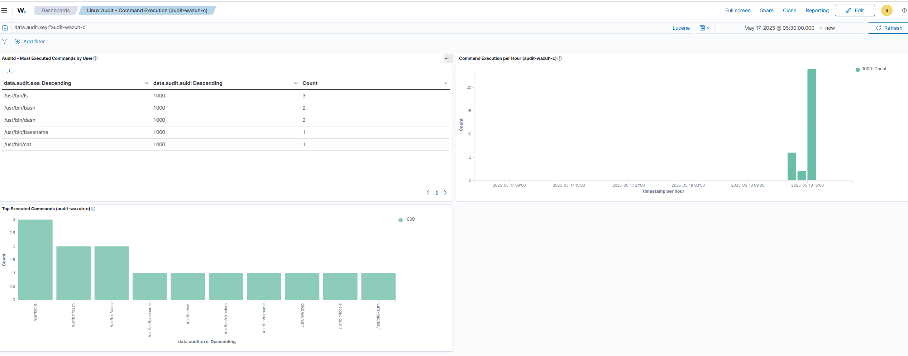

# 📊 Dashboard: Linux Audit - Command Execution (`audit-wazuh-c`)

This dashboard is designed to visualize executed commands on Linux systems using auditd logs collected by Wazuh. It helps identify suspicious behavior, active users, and execution patterns.

## ⬇️ NDJSON Export
You’ll find the file `linux-audit-wazuh-dashboard.ndjson` in this repo.

To export it manually:
1. Go to **Stack Management > Saved Objects**
2. Click **Export**
3. Select the visualization and dashboard
4. Download `linux-audit-wazuh-dashboard.ndjson`

To import it elsewhere, use the same menu via **Saved Objects > Import**.

📁 File location: [`linux-audit-wazuh-dashboard.ndjson`](Download/linux-audit-wazuh-dashboard.ndjson)

## 📈 Included Visualizations

### 1. Command Execution per Hour (Bar Chart)
- **Type**: Vertical Bar
- **X-Axis**: `@timestamp` (grouped by hour)
- **Y-Axis**: Count
- **Global filter**: `data.audit.key:"audit-wazuh-c"`

### 2. Executed Commands Table
- **Type**: Data Table
- **Buckets**:
  - Split rows → `data.audit.exe`
  - Split rows → `data.audit.euid` (optional)
- **Fields displayed**:
  - `agent.name`
  - `data.audit.command`
  - `data.audit.exe`
  - `data.audit.cwd`
  - `data.audit.key`
  - `user.name`
  - `data.audit.tty`

## ✅ Requirements Met
Before exporting or sharing this dashboard, ensure:
- You're using the index pattern: `wazuh-alerts-*`
- Logs contain the following fields:
  - `data.audit.command`
  - `data.audit.exe`
  - `data.audit.cwd`
  - `data.audit.key`
  - `user.name`
- The key `data.audit.key = "audit-wazuh-c"` is properly indexed

---

## 🔍 Visualization: Executed Commands (Data Table)
1. **Go to** `Visualize > Create visualization`
2. Choose **Data Table**
3. Use index: `wazuh-alerts-*`
4. Apply filter: `data.audit.key = "audit-wazuh-c"`
5. Add Bucket:
   - Split rows > `data.audit.exe`
   - Aggregation: Terms, Order: Descending by Count, Size: 10+
6. (Optional) Add another bucket: `data.audit.euid` or `user.name`
7. Click Apply (check or curved arrow)
8. Save as: **Auditd - Most Executed Commands by User**

## 🔄 Add Visualization to Dashboard
1. Make sure it's saved
2. Go to your dashboard
3. Click **Edit > + Add**
4. Find the visualization by name
5. Click **Add**, adjust size if needed
6. Click **Save**

## 📅 Suggested Dashboard Metadata
- **Title**: `Linux Audit - Command Execution (audit-wazuh-c)`
- **Description**:
  > Displays the most frequently executed commands captured via auditd for events matching the key `"audit-wazuh-c"`. Useful for monitoring user activity and detecting abnormal usage patterns.

## ⚠️ If Your Visualization Is Missing
- Make sure it's saved
- Make sure index pattern matches
- Go to `Visualize > Library` to confirm it’s there

---

## 📊 Visualization: Top Executed Commands (Bar Chart)
### 1. Setup
- Type: **Vertical Bar**
- Index: `wazuh-alerts-*`
- Filter: `data.audit.key: "audit-wazuh-c"`

### 2. X-Axis
- Add → Buckets → X-Axis
- Aggregation: Terms
- Field: `data.audit.exe`
- Order by: Count, Order: Desc, Size: 10+

### 3. Y-Axis
- Aggregation: Count (default)

### 4. (Optional) Split Series
- Add → Split Series
- Aggregation: Terms
- Field: `data.audit.euid` or `user.name`

### 5. Save Visualization
- Title: `Top Executed Commands (audit-wazuh-c)`
- Optional Description: > Shows the most executed binaries by auditd key `"audit-wazuh-c"`

---

## 📊 Visualization: Commands Executed per Hour
### 1. Setup
- Type: **Vertical Bar**
- Index: `wazuh-alerts-*`
- Filter: `data.audit.key = "audit-wazuh-c"`

### 2. Y-Axis
- Aggregation: Count

### 3. X-Axis (Date Histogram)
- Field: `@timestamp`
- Interval: Hourly

### 4. (Optional) Split Series by User
- Add → Split Series
- Aggregation: Terms
- Field: `data.audit.euid` or `user.name`

### 5. Save Visualization
- Title: `Command Execution per Hour (audit-wazuh-c)`
- Optional Description: > Shows hourly execution volume from auditd logs with key `"audit-wazuh-c"`

---

## 📸 Screenshot

---
With this, your dashboard is fully documented, visualized, saved, and ready to share across environments 🚀
