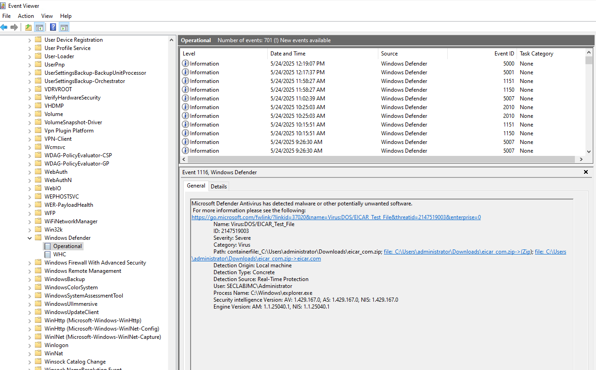
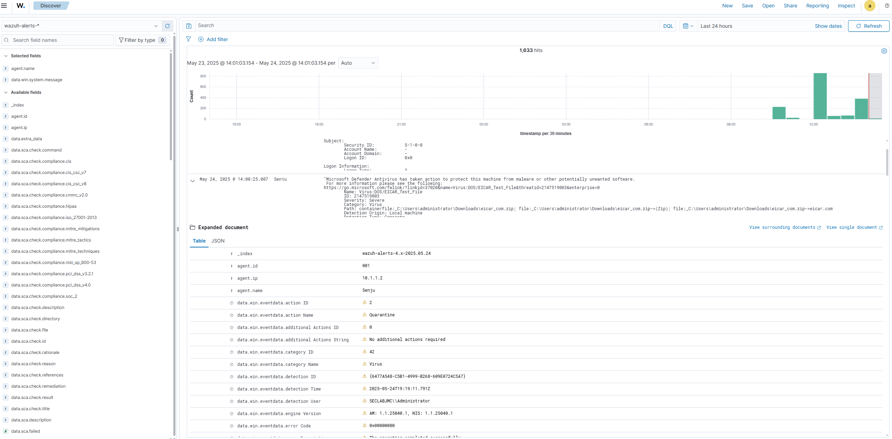

# Windows Defender Malware Detection - Wazuh Integration Lab

This lab demonstrates how to collect, monitor, and visualize malware detection logs from **Windows Defender** using the **Wazuh agent** on a Windows endpoint. It validates the integration by simulating malware detection using the [EICAR test file](https://www.eicar.org/download-anti-malware-testfile/).

---

## 📌 Objective

Capture real-time antivirus events (malware detections) from **Windows Defender**, send them to the **Wazuh manager**, and view them in **Kibana** via the `wazuh-alerts-*` index.

---

## 🖥️ Environment

| Component     | Hostname     | IP Address  | Role            |
|---------------|--------------|-------------|-----------------|
| Windows 10    | Senju        | 10.1.1.2     | Wazuh Agent     |
| Wazuh Manager | Sunugakure   | 10.1.3.11    | Log Collector   |


---

## 🧪 Steps

### 1. Enable Windows Defender Logging

Open **Event Viewer**:

```
Event Viewer → Applications and Services Logs → Microsoft → Windows → Windows Defender → Operational
```

📸 Screenshot: 


---

### 2. Configure Wazuh Agent to Read Defender Logs

Edit the Wazuh agent configuration on the Windows machine:

```xml
<!-- Log analysis -->
<localfile>
  <location>Microsoft-Windows-Windows Defender/Operational</location>
  <log_format>eventchannel</log_format>
</localfile>
```

File path:
```
C:\Program Files (x86)\ossec-agent\ossec.conf
```

---

### 3. Restart Wazuh Agent

```powershell
NET STOP WazuhSvc
NET START WazuhSvc
```

Confirm startup in `win32ui.exe` → **View Logs**:

```
Analyzing event log: 'Microsoft-Windows-Windows Defender/Operational'.
```

---

### 4. Simulate Malware Detection with EICAR

1. Disable Defender temporarily.
2. Download EICAR from:
   [https://www.eicar.org/download-anti-malware-testfile/](https://www.eicar.org/download-anti-malware-testfile/)
3. Download the `eicar_com.zip` file.
4. Re-enable Defender.
5. Extract or open the file to trigger detection.

Defender should generate a **Severe** event with signature: `Virus:DOS/EICAR_Test_File`.

---

### 5. Verify in Wazuh/Kibana

1. Go to `Discover` tab.
2. Select the index pattern: `wazuh-alerts-*`
3. Filter by:
   - `agent.name: "Senju"`
   - Add fields: `data.win.system.message`

📸 Screenshot: `wazuh-02-malware.png`


---

## ✅ Results

- Defender events were successfully collected by the Wazuh agent.
- Wazuh forwarded the logs to the manager.
- Logs were indexed in Elasticsearch and visualized in Kibana.
- Detection, origin, severity, and affected files are visible in structured fields.

---

## 📝 Notes

- This test uses the [EICAR test file](https://www.eicar.org/download-anti-malware-testfile/), which is not malicious.
- Defender must be active to generate real alerts.
- Useful for building correlation rules, response automation, or SIEM dashboards.

---

## 📂 Files in this folder

| File                   | Description                       |
|------------------------|-----------------------------------|
| `wazuh-01-malware.png` | Screenshot from Event Viewer      |
| `wazuh-02-malware.png` | Screenshot from Kibana/Wazuh      |

---

## 🔜 Next Steps

- Create a Wazuh rule to tag Defender alerts with custom metadata.
- Trigger active response based on alert severity.
- Integrate with TheHive for automatic case creation.

---

> Lab conducted by [@jomocasec1990](https://github.com/jomocasec1990) — SOC Analyst Lab Series 🚨🛡️
