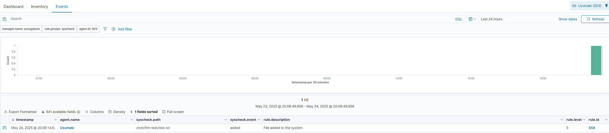

# Linux File Integrity Monitoring (FIM) Lab with Wazuh

This lab demonstrates how to configure File Integrity Monitoring (FIM) on a **Linux endpoint** using the Wazuh agent. It uses the `auditd` subsystem and enables **Whodata** to track who modified files and how.

---

## 🐧 1. Install Required Packages

```bash
sudo apt install auditd audispd-plugins
```

---

## 📡 2. Enable and Start auditd

```bash
sudo systemctl enable --now auditd
sudo systemctl status auditd
```

You should see the service active and running.

---

## 📂 3. Create FIM Test Folder

```bash
sudo mkdir /root/fim-test
cd /root/fim-test
```

---

## 🛡️ 4. Add FIM Rule to ossec.conf

On the Wazuh agent (Linux), edit `/var/ossec/etc/ossec.conf` and add under `<syscheck>`:

```xml
<directories check_all="yes" report_changes="yes" whodata="yes">/root/fim-test</directories>
```

Then restart the agent:

```bash
sudo systemctl restart wazuh-agent
```

---

## 🧪 5. Create Test File

```bash
echo "Hello World!" | sudo tee /root/fim-test/test.txt
```

Check Wazuh dashboard to verify event detection.



Example log:

```
Event: added
Mode: whodata
Path: /root/fim-test/test.txt
Hashes calculated and stored.
```

---

## ✏️ 6. Modify the File

```bash
echo "Hello Github!" | sudo tee /root/fim-test/test.txt
```

Event generated:

- Event: `modified`
- Rule ID: `550`
- Message: `Integrity checksum changed.`

Log shows hash diffs and file changes:

```json
"diff": "1c1\n< Hello World!\n---\n> Hello Github!\n"
```

---

## 🔍 Optional: Check audit rules

You can list the audit rules to verify the Wazuh agent inserted them:

```bash
auditctl -l | grep wazuh_fim
```

Example output:

```
-w /root/fim-test -p wa -k wazuh_fim
```

---

## ✅ Summary

This lab confirms that Linux FIM with Wazuh works as expected:
- Detects file additions and changes in monitored paths
- Uses `auditd` for Whodata context (user and process)
- Generates rich logs with hashes and diff comparisons

> Created by [@jomocasec1990](https://github.com/jomocasec1990) — Linux FIM Lab 🐧
