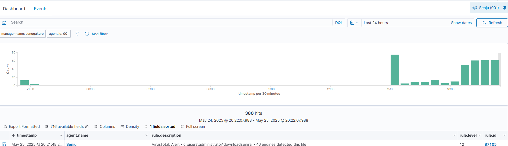
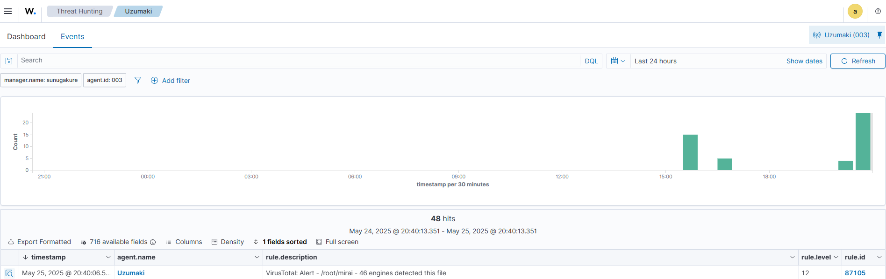

# 🧪 VirusTotal Integration Lab with Wazuh

This lab demonstrates how to integrate VirusTotal with Wazuh to automatically scan files detected by Syscheck and generate alerts for malicious files based on VirusTotal scan results.

## ⚙️ Integration Setup

1. Edit the Wazuh configuration file:

```bash
sudo nano /var/ossec/etc/ossec.conf
```

2. Add the following integration block:

```xml
<integration>
  <name>virustotal</name>
  <api_key>YourAPIKey</api_key>
  <group>syscheck</group>
  <alert_format>json</alert_format>
</integration>
```

3. Define a rule group in `local_rules.xml`:

```xml
<group name="virustotal,">
  <rule id="87100" level="10">
    <decoded_as>json</decoded_as>
    <field name="integration">virustotal</field>
    <description>VirusTotal integration messages.</description>
    <options>no_full_log</options>
  </rule>
</group>
```

## 🧪 Test on Windows 10 VM

1. Download the sample file:

```powershell
Invoke-WebRequest -Uri https://raw.githubusercontent.com/Mazuco/wazuh/main/mirai -OutFile C:/Users/Administrator/Downloads/mirai
```

2. The Wazuh manager receives and analyzes the hash, triggering the VirusTotal integration.

### Sample Alert from Windows Agent

- **File**: `c:\users\administrator\downloads\mirai`
- **SHA1**: `59b55795240efec884e0981991a3ffef19f19765`
- **Detections**: `46`
- **Permalink**: [VirusTotal Report](https://www.virustotal.com/gui/file/2aa2dbae345938386d93edb02d4f3aa3ad1b130c04b04e4e5c5c0d0e4ffe3181)



## 🧪 Test on Linux Agent

1. Add directory to be monitored:

```xml
<directories check_all="yes" realtime="yes" report_changes="yes">/root</directories>
```

2. Restart agent:

```bash
systemctl restart wazuh-agent
```

3. Download the file from root:

```bash
curl https://raw.githubusercontent.com/Mazuco/wazuh/main/mirai --output /root/mirai
```

### Sample Alert from Linux Agent

- **File**: `/root/mirai`
- **SHA1**: `59b55795240efec884e0981991a3ffef19f19765`
- **Detections**: `46`
- **Permalink**: [VirusTotal Report](https://www.virustotal.com/gui/file/2aa2dbae345938386d93edb02d4f3aa3ad1b130c04b04e4e5c5c0d0e4ffe3181)



---

## ✅ Results

Wazuh successfully integrated with VirusTotal to enrich FIM alerts with real-time threat intelligence. Malicious files were detected, flagged, and correlated with VirusTotal data including detection count and scan reports.
