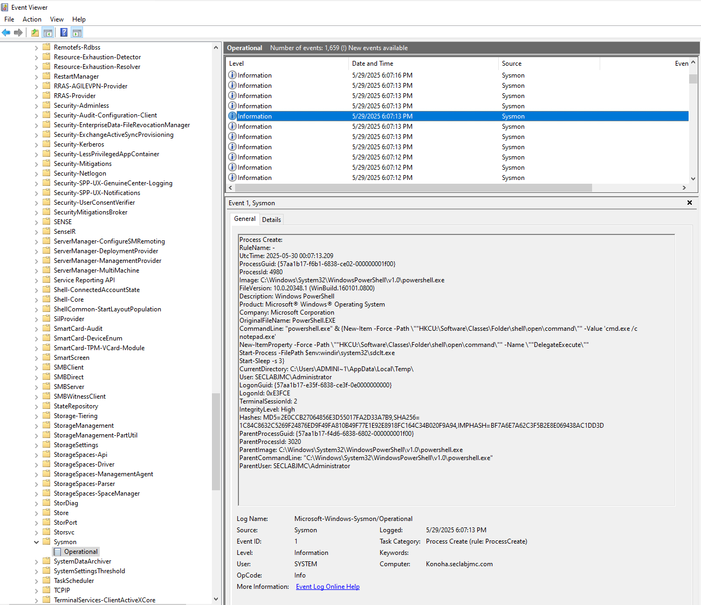
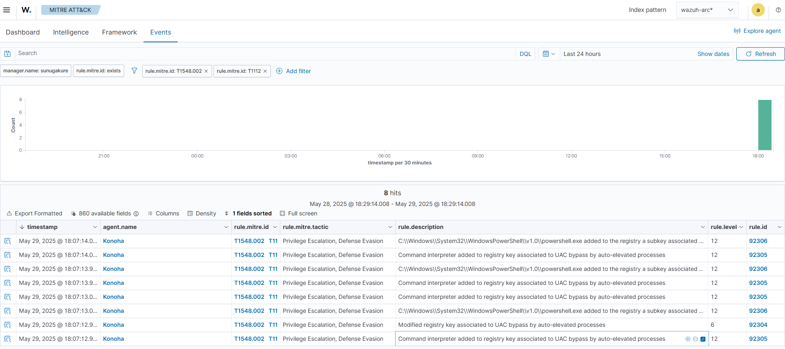

# 🛡️ Threat Hunting Lab: UAC Bypass Detection with Wazuh + Sysmon + Atomic Red Team

This lab demonstrates how to simulate and detect a **UAC Bypass (MITRE T1548.002)** using `Invoke-AtomicRedTeam`, Sysmon logging, and Wazuh SIEM integration. It is designed as part of a practical cybersecurity portfolio focused on detection engineering and threat hunting.

---

## 🧰 Lab Overview

- **Simulation Technique**: UAC Bypass (T1548.002) via `fodhelper.exe`, `eventvwr.exe`, `SilentCleanup`, etc.
- **Detection Tools**:
  - [Sysmon](https://learn.microsoft.com/en-us/sysinternals/downloads/sysmon) with [SwiftOnSecurity config](https://github.com/SwiftOnSecurity/sysmon-config)
  - [Wazuh](https://wazuh.com/)
  - Custom Sysmon rules in `ossec.conf` and `local_rules.xml`
- **Attack Emulation**: 
  - [APTSimulator](https://github.com/NextronSystems/APTSimulator)
  - [Atomic Red Team](https://github.com/redcanaryco/invoke-atomicredteam)

---

## ⚙️ Infrastructure

- `Wazuh Server` (Manager: `sunugakure`)
- `AD Controller`, `PA-FW`, `Kibana` (Optional in lab context)

---

## 📦 Installation Steps

### Sysmon Deployment

```powershell
Invoke-WebRequest -Uri https://raw.githubusercontent.com/jomocasec1990/wazuh-siem-lab/main/09-Threat-Hunting-T1548/Rules/sysmonconfig-export.xml -OutFile C:\Users\Administrator\Downloads\Sysmon\sysmonconfig-export.xml
.\Sysmon.exe -accepteula -i sysmonconfig-export.xml
```
📌 The Sysmon configuration is tuned to log process creation, registry changes, and other key behaviors related to UAC bypass techniques.

### Wazuh Configuration

**Add to `ossec.conf`:**

```xml
<localfile>
  <location>Microsoft-Windows-Sysmon/Operational</location>
  <log_format>eventchannel</log_format>
</localfile>
```

**Download Rules:**

```bash
curl -O  https://raw.githubusercontent.com/jomocasec1990/wazuh-siem-lab/main/09-Threat-Hunting-T1548/Rules/0999-sysmon_rules.xml -o /var/ossec/ruleset/rules/0999-sysmon_rules.xml
chmod 650 /var/ossec/ruleset/rules/0999-sysmon_rules.xml
systemctl restart wazuh-manager
```

---

## ☣️ Simulating Attacks with Atomic Red Team

```powershell
IEX (IWR 'https://raw.githubusercontent.com/redcanaryco/invoke-atomicredteam/master/install-atomicredteam.ps1' -UseBasicParsing)
Install-AtomicRedTeam -getAtomics
Import-Module "C:\AtomicRedTeam\invoke-atomicredteam\Invoke-AtomicRedTeam.psd1"
Invoke-AtomicTest T1548.002 -ShowDetailsBrief
Invoke-AtomicTest T1548.002
Invoke-AtomicTest T1548.002 -Cleanup
```
🛠 This executes known UAC bypass methods to trigger relevant telemetry for detection testing.

---

## 📊 Screenshots & Detections

### 🧠 Sysmon Log Sample



### 📈 Detection via Wazuh - MITRE Mapping



### 🧾 Raw JSON Log in Wazuh

```yaml
Agent Name:        Konoha
Agent IP:          10.1.2.10
Manager:           sunugakure
Date (UTC):        2025-05-30 00:07:14
Process:           powershell.exe
User:              SECLABJMC\Administrator
Event ID:          13 (Registry Value Set)
Target Registry:   HKU\...\shell\open\command\DelegateExecute
MITRE Techniques:  - T1548.002 (Bypass UAC)
                   - T1112 (Modify Registry)
Tactics:           - Privilege Escalation
                   - Defense Evasion
Alert Description:
  "powershell.exe added a registry key used by auto-elevated processes, indicating a potential UAC bypass attempt"
Rule Level:        12 (High)
Wazuh Rule ID:     92306
Sysmon Channel:    Microsoft-Windows-Sysmon/Operational
```
---

## 🧠 MITRE Techniques Detected

| Technique | Tactic |
|----------|--------|
| T1548.002 | Privilege Escalation, Defense Evasion |


---

## 📚 References

- [Atomic Red Team - Red Canary](https://github.com/redcanaryco/atomic-red-team)
- [Sysmon Config - SwiftOnSecurity](https://github.com/SwiftOnSecurity/sysmon-config)
- [MITRE ATT&CK - T1548.002](https://attack.mitre.org/techniques/T1548/002/)
- [Wazuh Rule Development Docs](https://documentation.wazuh.com)

---

## 👨‍💻 Author

Jordan Moran Cabello | [@jomoca](https://github.com/jomoca)
