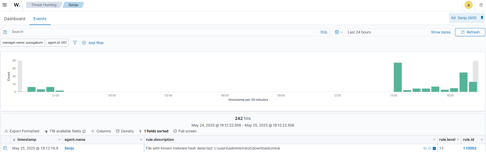

# Wazuh CDB List Lab: Detecting Malware Hashes

This lab demonstrates how to configure Wazuh to detect files with known malware hashes using a custom list and rules.

---

## 📁 Step 1: Create a Custom CDB List

```bash
sudo nano /var/ossec/etc/lists/malware-hashes
```

Example contents:

```
e0ec2cd43f71c80d42cd7b0f17802c73:mirai
55142f1d393c5ba7405239f232a6c059:Xbash
F71539FDCA0C3D54D29DC3B6F8C30EOD:fanny
```

## ⚙️ Step 2: Register the List in `ossec.conf`

Edit the configuration:

```bash
sudo nano /var/ossec/etc/ossec.conf
```

Add:

```xml
<ruleset>
  <decoder_dir>ruleset/decoders</decoder_dir>
  <rule_dir>ruleset/rules</rule_dir>
  <rule_exclude>0215-policy_rules.xml</rule_exclude>
  <list>etc/lists/audit-keys</list>
  <list>etc/lists/amazon/aws-eventnames</list>
  <list>etc/lists/security-eventchannel</list>
  <list>etc/lists/malware-hashes</list>
</ruleset>
```

## 🔐 Step 3: Set Correct File Permissions

```bash
chown wazuh:wazuh /var/ossec/etc/lists/malware-hashes
chmod 660 /var/ossec/etc/lists/malware-hashes
```

## 🛡️ Step 4: Create the Rule in `local_rules.xml`

```bash
sudo nano /var/ossec/etc/rules/local_rules.xml
```

Rule content:

```xml
<group name="malware,">
  <rule id="110002" level="13">
    <!-- The if_sid tag references the built-in FIM rules -->
    <if_sid>554, 550</if_sid>
    <list field="md5" lookup="match_key">etc/lists/malware-hashes</list>
    <description>File with known malware hash detected: $(file)</description>
    <mitre>
      <id>T1204.002</id>
    </mitre>
  </rule>
</group>
```

## 🖥️ Step 5: Configure Agent to Monitor Downloads Folder

On the Windows agent, edit `ossec.conf`:

```xml
<directories check_all="yes" report_changes="yes" realtime="yes">C:\Users\administrator\Downloads</directories>
```

Disable real-time protection in **Virus & Threat Protection** to allow file creation for testing.

## 📦 Step 6: Download and Test

On the agent, download the test file:

```powershell
Invoke-WebRequest -Uri https://raw.githubusercontent.com/Mazuco/wazuh/main/mirai -OutFile C:/Users/Administrator/Downloads/mirai
Get-FileHash "C:/Users/Administrator/Downloads/mirai" -Algorithm MD5
```

Expected hash: `E0EC2CD43F71C80D42CD7B0F17802C73`

## 📊 Step 7: Validate Detection in Wazuh

Go to Wazuh → Threat Hunting → Filter by:
- `agent.name: Senju`
- `rule.id: 110002`

You should see an alert like:

```
File with known malware hash detected: c:\users\administrator\downloads\mirai
```



---

## ✅ Result

Successfully configured Wazuh to detect known malware files using MD5 hashes and custom rules with CDB lists.
